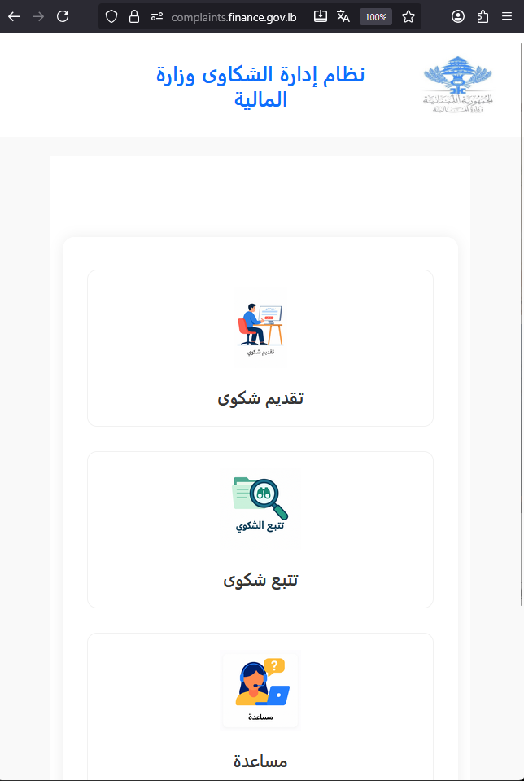
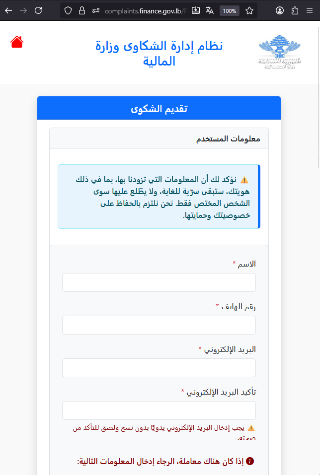
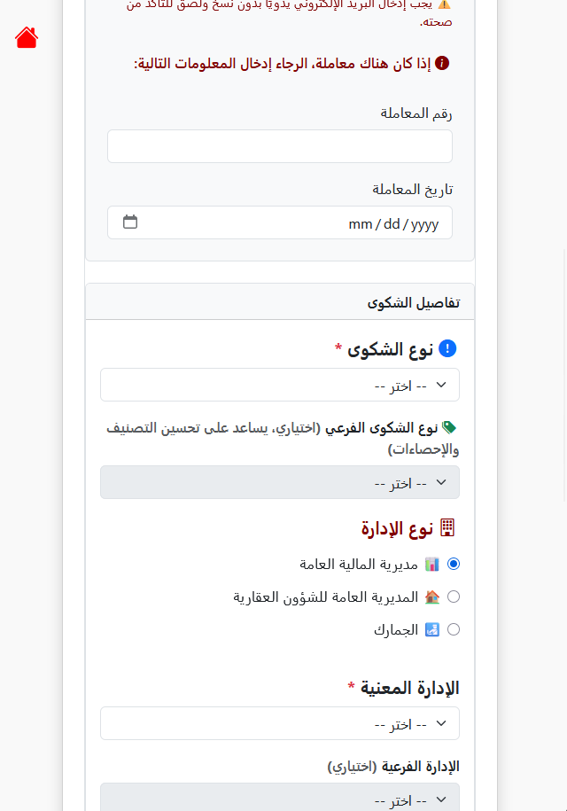
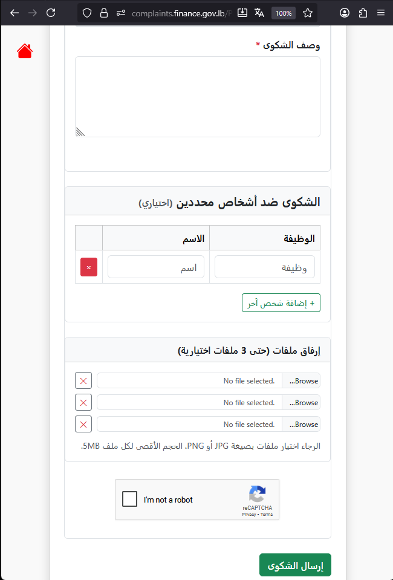
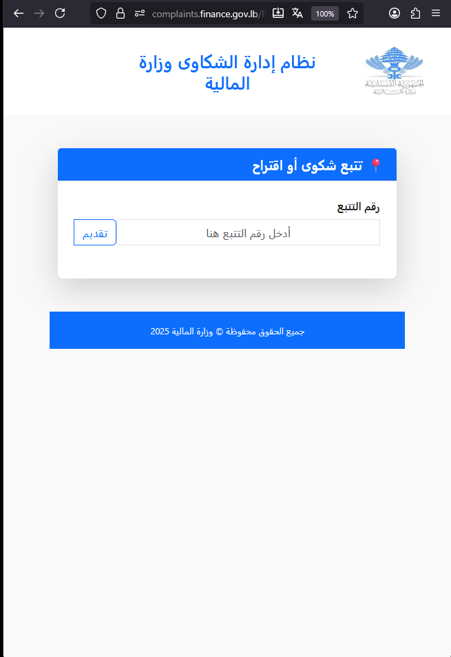

# Complaint Management System (Ministry of Finance, Lebanon)

**Designed and developed by Ali Abdallah**

---

## 🏛️ Overview
A comprehensive Complaint Management System developed for the Ministry of Finance (Lebanon) to enhance citizen engagement and improve transparency in handling and tracking public complaints.

The system was fully designed and implemented from concept to deployment, providing role-based access, automated workflows, and analytical dashboards that support informed decision-making across departments.

This repository offers a **high-level overview and demonstration**, including conceptual architecture and safe screenshots (no confidential data or code).  
It is intended purely for professional and educational presentation purposes.

---

## 🎯 Key Features
- End-to-end complaint submission, assignment, and tracking with role-based access  
- Automated email confirmations and tracking numbers for citizens  
- Secure file and media attachment handling  
- Statistical dashboards and Excel-based reporting for management insights  
- Scalable 3-layer architecture built on ASP.NET Web Forms, ADO.NET, and SQL Server  
- Full workflow automation using stored procedures for performance and data consistency  

---

## 🧩 System Architecture (Conceptual)

---

## 📸 Screenshots

*Main interface showing citizen entry options.*

*Complaint submission workflow with validation and tracking.*

*Complaint tracking and status inquiry interface for citizens.*

---

## 👤 Author
**Ali Abdallah**  
Senior .NET Developer | API Integrations & Automation | ASP.NET Core | SQL Server | Clean Architecture  
[LinkedIn Profile](https://www.linkedin.com/in/aliabdallah-dotnet/)

---

## ⚠️ Disclaimer
This repository is for **portfolio and demonstration purposes only**.  
All operational rights and data remain the property of the **Ministry of Finance, Lebanon**.

